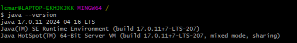
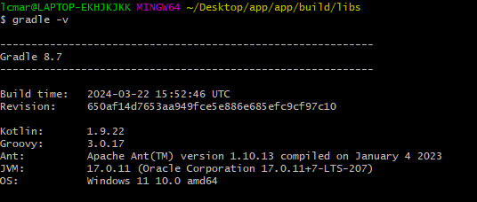
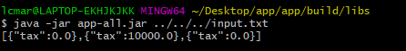
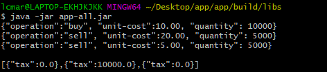
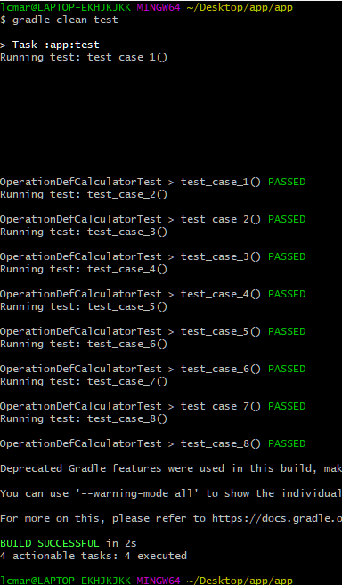

# Capital gain
## _Projeto em feito em java para calculo de ganhos de capital_

O projeto foi feito para receber entradas tanto pelo console quanto por arquivo de texto a ser passado como argumento para o jar via linha de comando

## features

- recebe entrada de dados de operacoes via via **stdin**
- recebe entrada de dados de operacoes via **arquivo de texto passado com argumento** para o jar

## technologias utilizadas

- [Java 17]          - versão estável e adotada do java
- [Gradle 8.7]       - última versão do gradle
- [intellij]         - Comunity edition
- [Jackson]          - para tratar o parse das entradas e saídas
- [shadowjar]        - empacotamento de dependencias no jar
- [org.junit.jupiter]    -  para testes

## pre-requisitos para buildar o projeto
- SDK 17 
  
- gradle 8.7 
  

## arquitetura

pretendi aqui usar a arquitetura ports and adapters isolando a aplicação cujo foco são o cálculo dos ganhos e taxas
a serem pagas por cada operação, da entrada de dados feita na camada adapters que implementa uma interfaçe definida no domínio da aplicação.

usei o junit.jupter para testes dado que o uso de uma lib facilita tais atividades.

construi o esqueleto da aplicação usando o gradle (gradle init)

## build/uso

estando dentro da pasta app/app onde se encontra o arquivo build.gradle 
execute o comando **'gradle build'** 
após fazer o build do projeto:
>> o jar será gerado dentro da pasta app/app/build/libs com o nome app-all.jar
>
> para usá-lo com um arquivo de entrada digite por exemplo:  
> java -jar app-all.jar ../../../input.txt
>
>> o arquivo de texto input.txt que está no projeto contém a seguinte estrutura 
>> {"operation": "buy", "unit-cost": 10.00, "quantity": 10000} 
>> {"operation": "sell", "unit-cost": 20.00, "quantity": 5000} 
>> {"operation": "sell", "unit-cost": 5.00, "quantity": 5000}
>
> e a saida será esta: 
>
> para usá-lo inputando as operações via console digite: 
> java -jar app-all.jar  
>
> o programa vai ficar esperando a digitação das entradas, use as linhas do arquivo input.txt dando um enter após cada entrada, para finalizar digite uma linha vazia e aperte enter
>e a saida será esta: 
>

#tests
estando na pasta /app/app rode gradle clean test e a seguinte saida será apresentada:
>